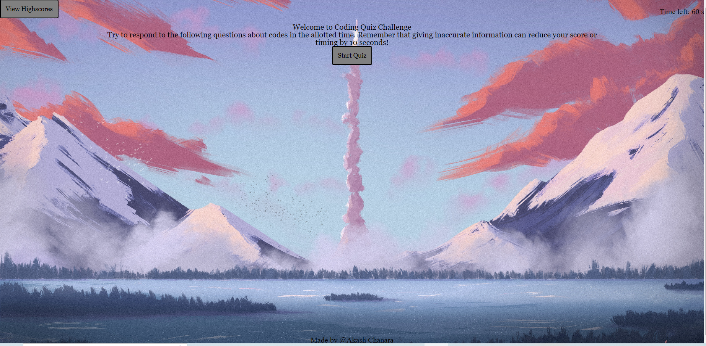
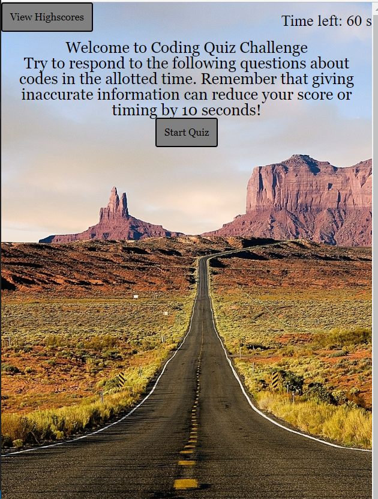

# Code-Quiz

# Description

Javascript is used by programmers across the world to create dynamic and interactive web content like applications and browsers. JavaScript is so popular that it's the most used programming language in the world, used as a client-side programming language by 97.0% of all websites

There are a total of 8 multiple-choice questions in this JavaScript Code Quiz challenge. After finishing, you'll be given a grade. Your score will be put to a Highscore record once you submit your initial. You may keep track of your individual scores on the Highscore board, which also shows your best 5 scores.

The Webpage can easily access through this link[https://akash2040.github.io/Code-Quiz/]

# Table of Content

1. [HomePage](#homepage)
2. [Features](#features)
3. [CodeSnippet](#codesnippet)
4. [Tools](#tools)
5. [Prerequisites](#prerequisites)
6. [AuthorLinks](#authorlinks)

# HomePage




# Features

- Timer-set time limit
- 8 JavaScript multiple choice questions
- Check your answer and show correct answer
- Local record-save your initial and score to local
- Highscore-check top 5 high score record

# CodeSnippet

```fuction set timer
    function countdown() {
    var timerInterval = setInterval(function () {
        secondsLeft--;
        timeLeft.textContent = "Time left: " + secondsLeft + " s";
    if (secondsLeft <= 0){
    clearInterval(timerInterval);
    timeLeft.textContent = "Time is up!";
    // if time is up, show on score board content instead of "all done!"
    finish.textContent = "Time is up!";
    gameOver();
    } else  if(questionCount >= questionSource.length +1) {
        clearInterval(timerInterval);
        gameOver();
        }
    }, 1000);
}
```

```Check answer
function checkAnswer(event) {
    event.preventDefault();
    //make it display
    checkLine.style.display = "block";
    setTimeout(function () {
        checkLine.style.display = 'none';
    }, 1000);

    // answer check
    if (questionSource[questionNumber].answer == event.target.value) {
        checkLine.textContent = "Correct!";
        totalScore = totalScore + 1;

    } else {
        secondsLeft = secondsLeft - 10;
        checkLine.textContent = "Wrong! The correct answer is " + questionSource[questionNumber].answer + " .";
    }
         //presente another question
    if (questionNumber < questionSource.length -1 ) {
    // call showQuestions to bring in next question when any reactBtn is clicked
        showQuestion(questionNumber +1);
    } else {
    gameOver();
}
```

# Tools

1. VsCode
2. Git (windows)
3. Github

# Prerequisites

Software need to be install

- Vscode
- git
- github(clone project)

# AuthorLinks

[Github](https://github.com/akash2040/Horiseo-Refactor)
